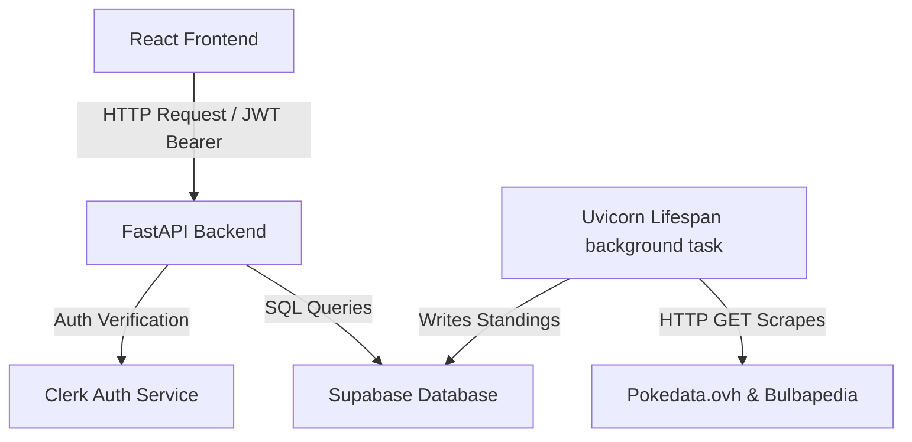

# How do AI agents develop Play! South Wales?

This document outlines system architecture, build commands, and coding standards. It guides AI agents (like Antigravity or Claude Code) when modifying code or documentation.

## Plan

- **Overview**: System standards, setup commands, and agent configurations
- **Goal**: Maintain consistency in code architecture, style guidelines, and documentation
- **Audience**: AI assistants modifying files in the repository
- **Content Plan**: Document tech stack, developer command reference, frontend design system, database rules, and agent skills mapping
- **Open Questions**: None

## System topology and tech stack

The application uses a separated client-server design.

- **Vite frontend**: Single Page Application (SPA) written in React 19 and TypeScript, styled with Tailwind CSS v4, and powered by TanStack Query and TanStack Router
- **FastAPI backend**: Python REST API running on Python 3.14+, serving data models from Supabase and validating sessions via Clerk JSON Web Tokens (JWT)
- **Supabase database**: PostgreSQL database storing persistent tables for events, leagues, and leaderboards
- **Clerk authentication**: Identity provider managing user login states

Refer to the system topology diagram:



For detailed architectural flows, refer to [architecture.md](file:///C:/Users/lukee/Documents/Projects/playwales/docs/architecture.md).

## Local development workflow

You must run the application components in their corresponding environments.

### Installation and build commands

Run the following commands in the workspace root to install dependencies and run the servers:
- **Set up backend**: Navigate to [backend](file:///C:/Users/lukee/Documents/Projects/playwales/backend) to build the virtual environment:
  ```bash
  cd backend
  python -m venv .venv
  .venv\Scripts\Activate.ps1
  pip install -r requirements.txt
  ```
- **Run backend**: Start the development server using Uvicorn:
  ```bash
  uvicorn app.main:app --host 127.0.0.1 --port 5000 --reload
  ```
- **Set up frontend**: Navigate to [frontend](file:///C:/Users/lukee/Documents/Projects/playwales/frontend) to install npm packages:
  ```bash
  cd frontend
  npm install
  ```
- **Run frontend**: Start the Vite developer server:
  ```bash
  npm run dev
  ```

For step-by-step local installation instructions, read [SETUP.md](file:///C:/Users/lukee/Documents/Projects/playwales/docs/SETUP.md).

### Verification and testing

Run these verification scripts to validate changes before pushing:
- **Lint backend**: Run Ruff to lint and format python code:
  ```bash
  ruff check .
  ruff format .
  ```
- **Test backend**: Run backend tests using Pytest:
  ```bash
  pytest
  ```
- **Lint frontend**: Run ESLint to lint typescript code:
  ```bash
  npm run lint
  ```
- **Format frontend**: Run Prettier to format frontend code:
  ```bash
  npm run format
  ```

## Code architecture standards

You must write clean, type-safe code that respects existing project patterns.

### Backend rules

FastAPI routes live in the [backend/app](file:///C:/Users/lukee/Documents/Projects/playwales/backend/app) directory.
- **Model validation**: Use Pydantic v2 schemas for all request payloads and response bodies
- **Endpoint routing**: Use APIRouter instances grouped by domain inside sub-routers
- **Authentication**: Secure administrative routes using the `require_auth` dependency with Clerk JWT headers
- **Synchronizations**: Uvicorn lifespan tasks handle automated event synchronization runs

### Frontend rules

React client files live in the [frontend/src](file:///C:/Users/lukee/Documents/Projects/playwales/frontend/src) directory.
- **File-based routing**: TanStack Router handles page routing, keeping routes in the `routes/` subdirectory
- **Data fetching**: Use TanStack Query hooks to cache and sync API requests
- **Strict typing**: Use TypeScript for all components and utility functions
- **Design tokens**: Follow the styling guidelines in [design.md](file:///C:/Users/lukee/Documents/Projects/playwales/frontend/design.md)

### Database rules

Postgres tables live on Supabase.
- **Migrations**: Write raw DDL SQL files in [supabase/migrations](file:///C:/Users/lukee/Documents/Projects/playwales/supabase/migrations) for schema updates
- **Local testing**: Apply mock data from [seed.sql](file:///C:/Users/lukee/Documents/Projects/playwales/supabase/seed.sql) to populate local tables
- **Row-Level Security (RLS)**: Enforce security policies on all persistent tables

For manual data syncs and database upgrades, follow [event_sync.md](file:///C:/Users/lukee/Documents/Projects/playwales/docs/event_sync.md).

## Frontend design system rules

You must style new interfaces according to the modern-minimal design system defined in [design.md](file:///C:/Users/lukee/Documents/Projects/playwales/frontend/design.md).

### Color palette

Use the following OKLCH colors defined in the global stylesheet:
- **Paper color**: `oklch(0.985 0.006 28)` for background surfaces
- **Card color**: `oklch(0.995 0.004 28)` for container items
- **Ink color**: `oklch(0.20 0.014 28)` for body text
- **Muted text**: `oklch(0.45 0.012 28)` for helper labels
- **Accent color**: `oklch(0.55 0.22 25)` for primary actions
- **Focus ring**: `oklch(0.48 0.15 250)` for interactive states

### Typography and interaction

Follow these design conventions:
- **Fonts**: Outfit for display headings, Geist for body text, and Geist Mono for code snippets
- **Emoji policy**: Use emojis only for event type markers
- **Hover effects**: Apply specific CSS transition transitions instead of broad transition resets
- **Call-to-action (CTA)**: Style primary actions with the accent background and bold Outfit font

## Agent skills reference

The repository contains pre-configured agent skills in the `.agents/skills` folder.

### Locked skills

The [skills-lock.json](file:///C:/Users/lukee/Documents/Projects/playwales/skills-lock.json) file locks these external skills:
- **api-design-principles**: Guides REST API endpoint structures and payload schemas
- **fastapi-templates**: Provides patterns for routers, dependency injection, and Pydantic validation
- **hallmark**: Governs the visual design and UX standards for page layouts
- **theme-factory**: Standardizes typography and color palettes for the project

### Utility and validation skills

You have access to these local skills:
- **lint-and-validate**: Runs validation commands after code edits
- **webapp-testing**: Tests browser behaviors using Playwright
- **fixing-accessibility**: Audits and repairs Web Content Accessibility Guidelines (WCAG) issues
- **systematic-debugging**: Follows systematic debugging protocols for test failures
- **tailwind-design-system**: Guides custom design systems with Tailwind CSS v4
- **tailwind-v4-shadcn**: Integrates shadcn/ui components with Tailwind CSS v4
- **supabase-postgres-best-practices**: Optimizes PostgreSQL schemas, indices, and Row-Level Security (RLS) policies
- **typescript-advanced-types**: Standardizes type-safe logic and complex TypeScript signatures

## Writing guidelines compliance

You must follow the project writing guidelines when generating comments, docstrings, or markdown files.

### Core prose rules

Apply these principles to your written output:
- **Active voice**: Use active verbs and specify the subject doing the action
- **Direct address**: Use `you` to address the reader directly
- **Concise phrasing**: Keep sentences under 20 words
- **No marketing fluff**: Avoid words like `easy`, `simple`, `quick`, `very`, `just`, or `really`
- **Paragraph structure**: Keep body paragraphs between 2 and 4 sentences
- **Heading style**: Use sentence case for headings and subheadings
