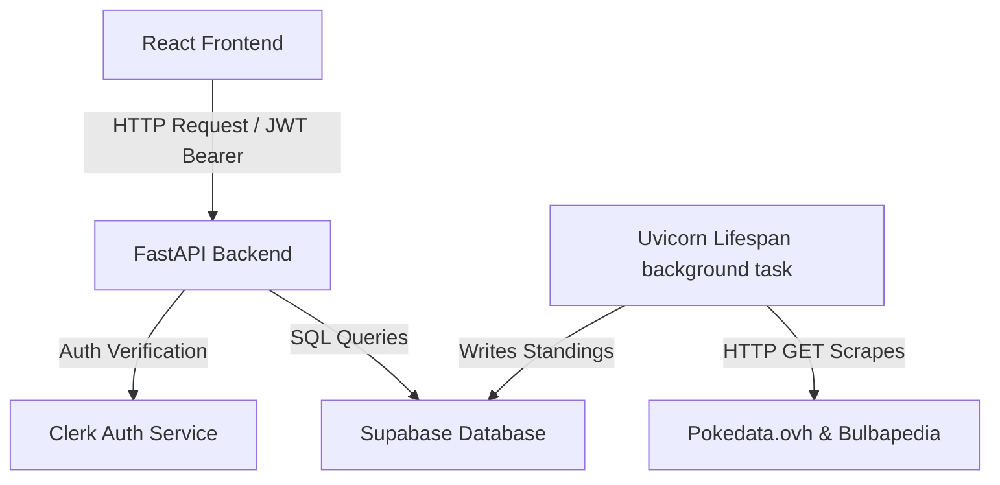

# How does the Play! South Wales application work?

This document explains the codebase architecture, data model relationships, and background synchronization flows of Play! South Wales.

## Plan

- **Overview**: Core concepts and architectural flows.
- **Goal**: Explain the integration of servers, authentication sync, and recurring schedules.
- **Audience**: Core maintainers designing new backend services or frontend features.
- **Content Plan**: Discuss system topology, authentication logic, virtual event ID formulas, and scraping pipelines.
- **Open Questions**: None.

## System topology

The application uses a separated client-server design.

- **Vite Frontend**: SPA written in React, styled with Tailwind CSS, and powered by TanStack Query and TanStack Router.
- **FastAPI Backend**: Python REST API serving data models from Supabase and validating sessions via Clerk.
- **Supabase Database**: PostgreSQL backend storing persistent tables (events, leagues, leaderboards).
- **Clerk Auth**: Identity provider managing user login states.

Data flows through standard HTTP queries:



---

## Authentication verification

The backend secures endpoints using Clerk verification headers.

The frontend retrieves a JSON Web Token (JWT) session token from Clerk. When sending request payloads, the client attaches this token inside the `Authorization` header.

The backend [require_auth](file:///C:/Users/Luke%20Enness/Documents/projects/playsouthwales/backend/app/auth.py#L13) dependency intercepts the request, decodes the token signature, and checks the authorized parties list. If validation fails, the backend returns a `401 Unauthorized` status immediately.

---

## Virtual IDs and recurring event generation

To minimize database storage, the system does not write every single occurrence of a weekly event to the database.

- **Weekly Event Template**: Stored in the `weekly_events` table (e.g., ID `1` represents Cardiff Casual League on Wednesdays).
- **Date Generation**: The frontend calculates all Wednesdays in the current month.
- **Virtual ID Formula**:
  The calendar assigns a virtual ID to each occurrence by multiplying the template ID by 10,000,000 and adding a date representation index:
  
  ```
  Virtual ID = template_id * 10000000
  ```
  
  For example, virtual ID `10000000` refers to template `1`.
- **Parsing Exclusions**:
  When a user deletes a single instance of a weekly series, the backend appends the selected date to the template's `excludedDates` list. The frontend reads this list and skips rendering that specific Wednesday.
- **Backend ID Extraction**:
  When a PUT, PATCH, or DELETE operation targets a virtual ID, the backend extracts the template identifier by integer dividing:
  
  ```python
  template_id = virtual_id // 10000000
  ```

---

## Synchronization lifecycle

The backend runs automated synchronization tasks using the FastAPI lifespan.

When the server starts, it spawns a background asyncio task. Every 60 minutes, the task executes three sync operations:

- **TCG sets sync**: Fetches Pokémon card expansion tables from Bulbapedia, calculates standard format legality, and writes to `sets.json`.
- **Pokedata schedule sync**: Pulls cup and challenge details from the pokedata.ovh API and inserts new events.
- **Top 20 Welsh players sync**: Syncs verified Welsh player profiles from the database and updates Championship Point (CP) standings in `top20.json`.
