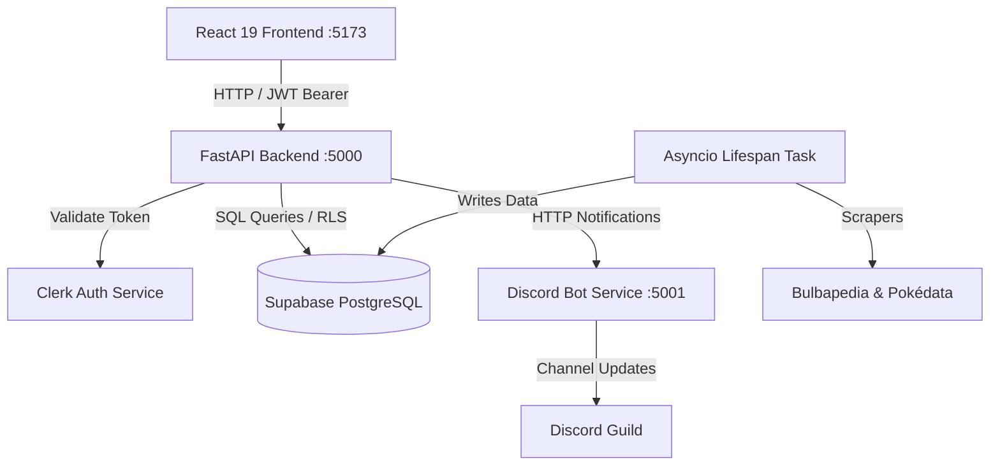

# Architecture Overview

Play! South Wales uses a decoupled client-server architecture with automated background scrapers.

## System topology


```mermaid
graph TD
    Client[React 19 Frontend :5173] -->|HTTP / JWT Bearer| API[FastAPI Backend :5000]
    API -->|Validate Token| Clerk[Clerk Auth Service]
    API -->|SQL Queries / RLS| DB[(Supabase PostgreSQL)]
    API -->|HTTP Notifications| Bot[Discord Bot Service :5001]
    Bot -->|Channel Updates| Discord[Discord Guild]
    Cron[Asyncio Lifespan Task] -->|Scrapers| Ext[Bulbapedia & Pokédata]
    Cron -->|Writes Data| DB
```

## Key architectural patterns

### 1. Authentication

- The frontend requests a session JWT from Clerk.
- Protected requests pass the token in `Authorization: Bearer <token>`.
- The backend `require_auth` dependency validates the token signature and authorized parties.

### 2. Virtual recurring event IDs

- To avoid generating infinite database rows, weekly recurring events stay as templates in `weekly_events`.
- The frontend derives virtual IDs:
  $$\text{Virtual ID} = \text{template\_id} \times 10{,}000{,}000$$
- When updating or deleting an occurrence, the backend extracts the template ID via integer division:
    ```python
    template_id = virtual_id // 10000000
    ```
- Specific holiday cancellations append dates to the `excluded_dates` array on the template.

### 3. Background scheduler

- An asyncio task runs inside FastAPI lifespan:
    - **Hourly**: Syncs local tournament schedules from Pokédata.
    - **Daily (>= 13:00 UTC)**: Syncs TCG card expansions and Championship Series standings.
