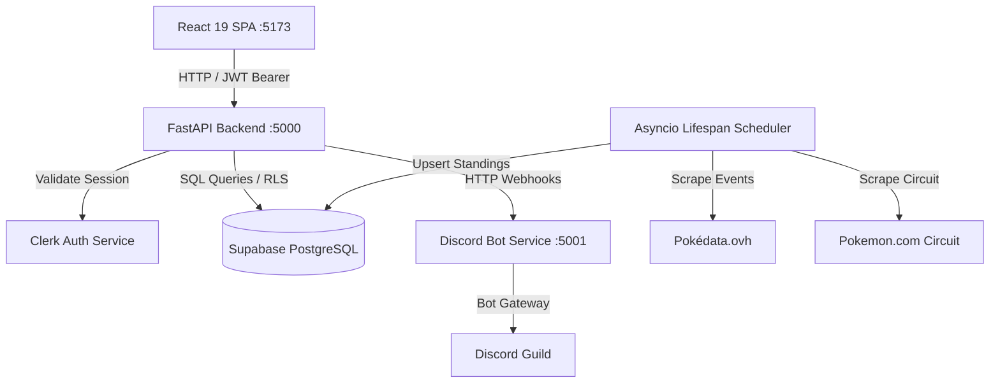

# Architecture overview

Play! South Wales connects Pokémon Trading Card Game and Video Game Championship communities across South Wales. The application combines a responsive web client, a high-performance REST API, automated tournament scrapers, and a Discord notification bot.

## System topology

The application adopts a decoupled client-server architecture. Each service operates independently and communicates across distinct network boundaries.


```mermaid
graph TD
    Client[React 19 SPA :5173] -->|HTTP / JWT Bearer| API[FastAPI Backend :5000]
    API -->|Validate Session| Clerk[Clerk Auth Service]
    API -->|SQL Queries / RLS| DB[(Supabase PostgreSQL)]
    API -->|HTTP Webhooks| Bot[Discord Bot Service :5001]
    Bot -->|Bot Gateway| Discord[Discord Guild]
    Scheduler[Asyncio Lifespan Scheduler] -->|Scrape Events| Pokedata[Pokédata.ovh]
    Scheduler -->|Scrape Circuit| Pokemon[Pokemon.com Circuit]
    Scheduler -->|Upsert Standings| DB
```

### Component responsibilities

- **Frontend client**: A single-page application built with React 19, Vite, TanStack Router, and TanStack Query. It handles UI rendering, calendar navigation, client-side filtering, and theme styling.
- **Backend API**: A FastAPI service running on Python 3.14. It enforces data validation via Pydantic v2, verifies Clerk JWT tokens, and manages database interactions.
- **Database layer**: A PostgreSQL database hosted on Supabase. It enforces Row-Level Security (RLS) policies and persists leagues, leaderboards, and tournament events.
- **Discord bot**: A Node.js service using Discordx. It receives webhook notifications from the backend and posts tournament announcements directly to community Discord channels.
- **Background scheduler**: An asynchronous background loop that runs within the FastAPI lifespan context. It regularly synchronizes tournament data from external community providers.

## Key architectural decisions

### 1. Virtual recurring event IDs

Standard tournament schedules repeat weekly. Pre-generating database records for recurring events creates thousands of redundant rows and complicates long-term calendar maintenance.

Instead, the system stores recurring schedules as single template rows in the `weekly_events` table. The frontend generates virtual event IDs using a mathematical multiplier:

$$\text{Virtual ID} = \text{template\_id} \times 10{,}000{,}000$$

When an administrator modifies or cancels a single weekly occurrence, the backend isolates the original template ID using integer division:

```python
template_id = virtual_id // 10000000
```

To cancel a recurring event on a specific holiday without affecting the rest of the schedule, the API appends the target date to the `excluded_dates` array on the template record.

### 2. Static data caching for card sets and regulations

Tournament legality schedules for card expansions and video game regulations update infrequently. In early versions, background workers scraped Bulbapedia on every run, introducing latency and fragility when HTML structures changed.

The system now bundles legality schedules directly inside [backend/app/data/](file:///d:/Projects/playsouthwales/backend/app/data/) as `sets.json` and `regs.json`. The backend serves these static files instantly with zero database overhead and complete reliability.

### 3. Background scheduler lifecycle

FastAPI manages the background scheduler using its asynchronous lifespan context manager. This ensures scheduler tasks start cleanly with the web application and terminate gracefully during shutdowns.

The scheduler maintains two distinct schedules:

- **Hourly sync**: Runs every hour to pull the latest local tournament schedules from Pokédata and recalculate player Championship Points.
- **Daily sync**: Executes once daily after 13:00 UTC to refresh global Championship Series standings and circuit announcements.

### 4. Authentication and security model

User authentication relies on Clerk JSON Web Tokens (JWT). The React client acquires a session token from Clerk and includes it within the `Authorization: Bearer <token>` header for administrative requests.

The backend [require_auth](file:///d:/Projects/playsouthwales/backend/app/auth.py) dependency decodes and verifies the token against Clerk public keys. The dependency verifies issuer URLs, token expiration, and authorized parties before granting access to mutation endpoints.
